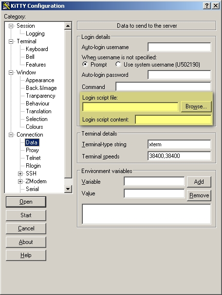

<div style="text-align: center;"><iframe src="gad.html" frameborder="0" scrolling="no" style="border: 1px solid gray; padding: 0; overflow:hidden; scrolling: no; top:0; left: 0; width: 100%;" onload="this.style.height=(this.contentWindow.document.body.scrollHeight+5)+'px';"></iframe></div>
## Automatic logon script

It is possible to automate some actions depending on what characters are sent by the server and printed to the screen. It's a sort of **challenge response**. For example it is possible to automate connection on telnet servers.
You have to create a simple text file with one line for expected characters and another line for text to send ... and so on.
 
**Example: telnet connection where login and password are sent automatically:**
```
login:
user1
password:
toto
```
 
 
Then you just have to set the full path to this file in the **Connection/Data**' tab of the configuration box. The encrypted content of the file will be saved only. And after that you can delete the original file.



Last remark: don't forget it can't work with ssh authentication. SSH is not a passive protocol (like telnet), and with ssh, authentication is completely part of the protocol
